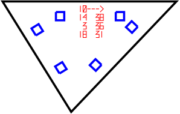

Explision
---------

This program will explode your models for you so that you can then build
them back toghether from magnificent lasercut triangles of plywood, acryl or
MDF. The tool is meant for making physical models of any 3D model. The only
known limitations are printbed size and very sharp angles.

Compiling
---------

To compile the code, just run make from the commandline

	cd path/to/this/directory/
	make

Running
-------

If you are running the program to make printable pieces make sure to edit
the configuration file to match your material measurements and the kerf of
your cut. The default settings are for 4mm MDF.

Running the code is as simple as this:

	./explision yourmodel.ply

Unfortunately the file parser is very picky about the format of the model
files it is given. The program takes input files in the PLY (stanford
polygon file format) and outputs SVG drawings.

For preprocessing the models MeshLab has been used. It's an opensource
program for processing 3D models and data. The refetence format used in
development is the ply files that meshlab exports when using the default
settings and unchecking the "Binary encoding" box. MeshLab should be able to
open pretty much anything, so it can be used to convert files.

MeshLab also has a measuring tool that will measure the size of the model.
In explision the measurements are interpreted as being in millimeters, so if
your model measures 157.65 in meshlab, it will be that many millimeters wide.

Printing
--------

Open the svg files from the design_files directory in your favourite vector
grapgics editor, like GIMP. Then combine all the pieces and do some manual
ordering if needed.

- The red lines should be cut first, with a low power setting on the laser
because they are only documenting the pieces and their relative positions.
This means they only need to leave a mark, not cut through the material.

- The blue lines should be cut next to avoid parts moving in the middle of the
cutting.

- The black borders should be cut last.

There is probably a "select by colour" tool in your editor, that should make
printing onlt parts at a time easy. Make sure not to move the material between
rounds.

Constructuing
-------------

The numbers on the triangles have meaning. The markings are a way to document
the way the pieces go togheter. Let's look at this by an example:

Now this is triangle number ten in the model, and it has connections to
triangles 14, 3 and 18. The connections start above the arrow and we count in
the direction of the arrow. The other column of numbers is the angle of the
connector that should be used for that specific connection.

So the top edge is connected to triangle 14 with a connector fot 38 degrees. The
triangle 14 will have a similar printout so we'll know what edge to connect to.
The next edge, moving clockwise on the edge is connected to triangle number 3
with a degree of 36 degrees. Finally the last edge connects to piece 18 with an
angle of 31 degrees.

Constructing the model might take some time but it's fun, a bit like a jigsaw
puzzle. A good tip is to start with sorting the connector pieces into piles for
0-10, 10-20, 20-30, etc. degrees, it really speeds things up. Also note that
negative degrees are not a bug, but a feature.

Contact
-------

For any questions, suggestions or offered help send me mail:
juha.kivekäs@helsinki.fi
