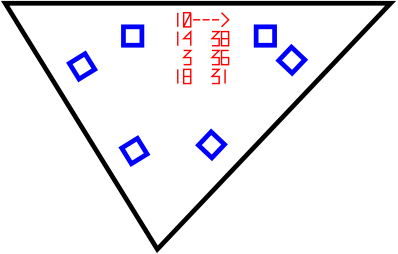

Explision
---------

This program  will explode your  models for you  so that you  can then
build  Them  back  together  from magnificent  lasercut  triangles  of
plywood, acrylic or MDF. The tool  is meant for making physical models
of any 3D model.

Compiling
---------

Install and compile the OpenMesh library

	git clone https://www.graphics.rwth-aachen.de:9000/OpenMesh/OpenMesh.git 
	cd OpenMesh
	mkdir build
	cd build
	cmake ..
	make

If the above doesn't work, then follow the instructions found here:

	http://www.openmesh.org/svn/
	http://www.openmesh.org/Daily-Builds/Doc/index.html

Open the  Makefile and edit the  `OPENMESH` variable to point  to your
compiled library:

	OPENMESH=~/Repos/OpenMesh

To compile the code, now just run make from the commandline:

	make

You  might have  to  create the  `build` and  `run`  directories when  you
compile the first time.

Running
-------

If you are  running the program to make printable  pieces make sure to
edit the  configuration file to  match your material  measurements and
the kerf of your cut. The settings need to be set at `src/material.h`.

Running the code is as simple as this:

	./explision yourmodel.ply

All file formats supported by OpenMesh can be used.

MeshLab is an open source project  that has a measuring tool that will
measure  the size  of the  model.  In explision  the measurements  are
interpreted as being in millimeters,  so if your model measures 157.65
in meshlab, it will be that many millimeters wide.

Printing
--------

Open the svg files from  the `design_files` directory in your favorite
vector graphics editor, like Inkscape. Then  combine all the pieces and do
some manual ordering if needed.

- The red lines  should be cut first, with a low  power setting on the
laser because they are only  documenting the pieces and their relative
positions. This means they only need  to leave a mark, not cut through
the material.

- The  blue lines  should be  cut next  to avoid  parts moving  in the
middle of the cutting.

- The black borders should be cut last.

There  is probably  a "select  by colour"  tool in  your editor,  that
should make printing only parts at a  time easy. Make sure not to move
the material between rounds.

Constructing
------------

The numbers on  the triangles have meaning. The markings  are a way to
document the  way the  pieces go  together. Let's look  at this  by an
example:

Now this is  triangle number ten in the model,  and it has connections
to triangles 14,  3 and 18. The connections start  above the arrow and
we count in the direction of the arrow. The other column of numbers is
the  angle of  the connector  that should  be used  for that  specific
connection.

So the top  edge is connected to  triangle 14 with a  connector for 38
degrees. The  triangle 14 will have  a similar printout so  we'll know
what edge to  connect to. The next edge, moving  clockwise on the edge
is connected to triangle number 3 with a degree of 36 degrees. Finally
the last edge connects to piece 18 with an angle of 31 degrees.

Constructing the model might take some time but it's fun, a bit like a
jigsaw  puzzle. A  good tip  is to  start with  sorting the  connector
pieces  into piles  for 0-10,  10-20, 20-30,  etc. degrees,  it really
speeds things up. Also note that negative degrees are not a bug, but a
feature.

Limitations
-----------
The only  known limitations  are printed size  and very  sharp angles.
Concave shapes should be working, but haven't been tested.

Contact
-------

If you want to contribute, feel free to check out the `TODO` list.
For  any questions, suggestions  or offered help send  me mail
guth.smash@gmail.com or direct messages on twitter `@_guttula`
